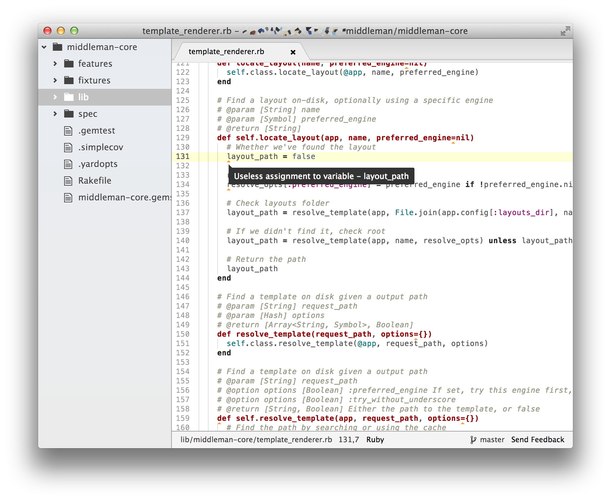

# atom-lint

Generic code linting support for [Atom](https://atom.io).



`atom-lint` is currently in alpha development.

## Supported Linters

More linters will be supported in the future.

* [RuboCop](https://github.com/bbatsov/rubocop) for Ruby

## Installation

```bash
$ apm install atom-lint
```

## Usage

Your source will be linted on open and on save automatically,
and the detected violations will be displayed as arrows in the editor.
You can see the detail of the violation by moving the cursor to it.

### Keymaps

* `Ctrl-Alt-L` for global toggle

## License

Copyright (c) 2014 Yuji Nakayama

See the [LICENSE.txt](LICENSE.txt) for details.
